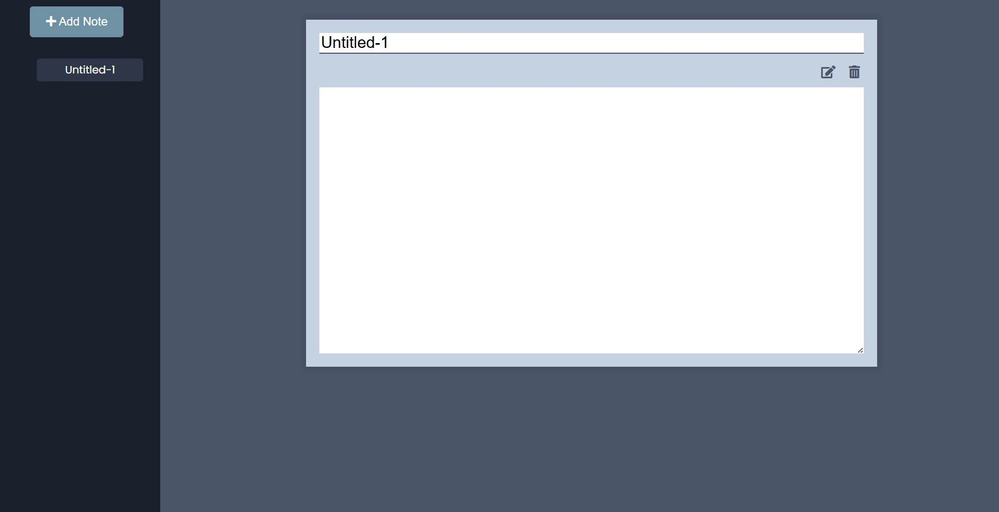

# TaskNote

A simple, intuitive note-taking application that allows users to create, edit, delete, and manage notes. Notes are stored in the browser's localStorage for persistent access across sessions.



## Features

- **Add New Notes**: Create new notes with a default title.
- **Edit Notes**: Update the title and content of existing notes.
- **Delete Notes**: Remove notes from the application.
- **Persistent Storage**: Store notes in localStorage to ensure they persist across browser sessions.
- **Dynamic Sidebar**: Display a list of notes in the sidebar for easy navigation.

## Demo

You can see the application in action with the following demo link: [Demo Link](https://mkraj-7838.github.io/TaskNote/)

## Installation

To get a local copy up and running, follow these simple steps:

1. **Clone the repo**
    ```sh
    git clone https://github.com/your-username/TaskNote.git
    ```

2. **Navigate to the project directory**
    ```sh
    cd note-taking-app
    ```

3. **Open `index.html` in your browser**

## Usage

1. Open the `index.html` file in your preferred web browser.
2. Click the 'Add' button to create a new note.
3. Edit the title and content of your notes directly within the note details view.
4. Click the delete button to remove a note.
5. Your notes will be saved in localStorage and persist across sessions.

